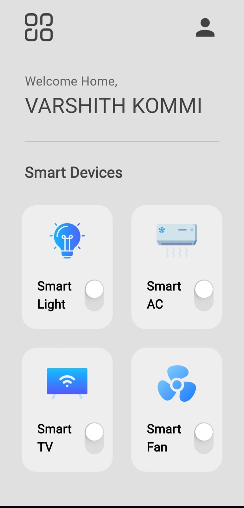
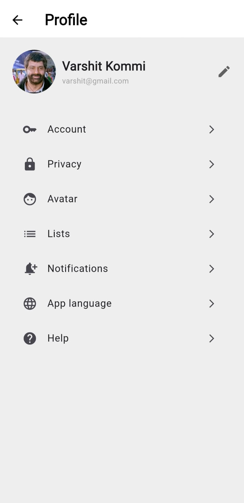
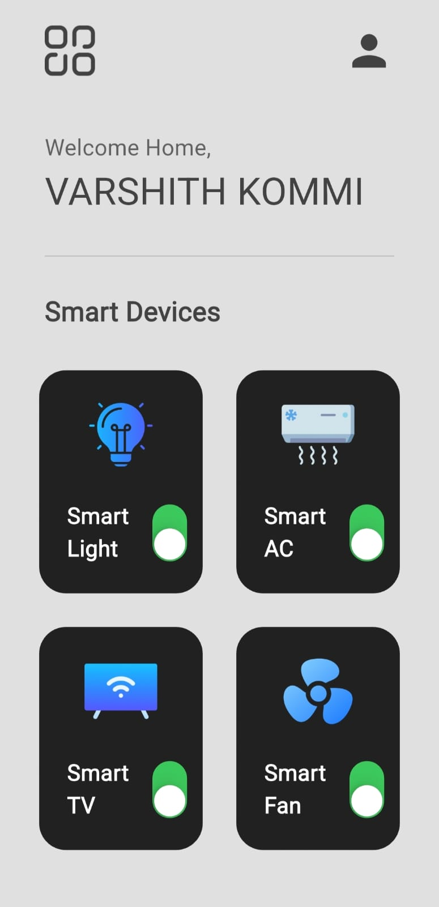

# 🔌 SmartHome App

A sleek and simple Flutter-based Smart Home controller UI. Control your smart devices with style and ease.

---

## 📱 Features

- 🔆 Toggle Smart Lights, AC, TV, Fan, and Fridge
- 🎨 Beautiful UI with custom icons
- 📶 Real-time device status
- 📋 Modular code with reusable widgets

---

## 🖼️ Screenshots

## 🖼️ Screenshots

<p align="center">
  
  
  
</p>


---

## 🚀 Getting Started

1. **Clone the repository:**
   ```bash
   git clone https://github.com/your-username/smarthome.git
   cd smarthome
   ```
